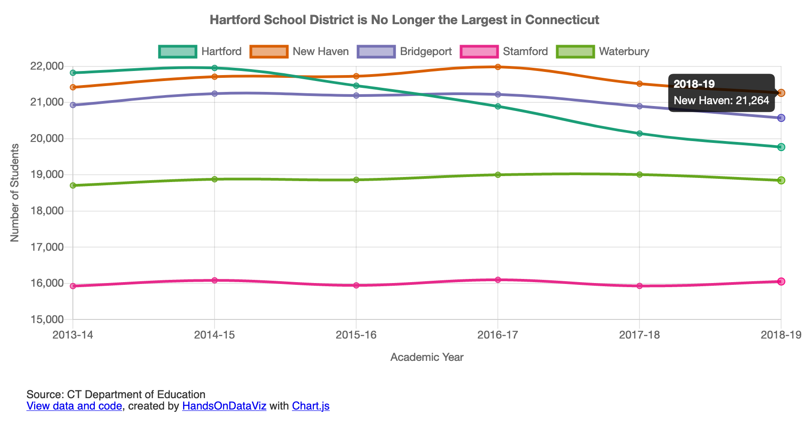

# Line Chart with One or More Series in Chart.js



## Demo 
https://handsondataviz.github.io/chartjs-line/

Sample data by CT Department of Education.

## Create your own
See chapter 10: Chart.js and Highcharts templates in [Hands-On Data Visualization](https://handsondataviz.org) by Jack Dougherty and Ilya Ilyankou

In `data.csv`, each row is a point in time (x-axis). Each column is a new series.
There can be any number of points in time (rows) and any number of series (columns).

The first column is always labels for the x-axis. Second and all other
columns are new series (lines), whose label is taken from the first row (header).

In `script.js`, you can customize the values of variables shown in the code snippet below. For more customization, see [Chart.js documentation](https://www.chartjs.org/docs/latest/).

```javascript
var TITLE = 'Hartford School District is No Longer the Largest in Connecticut';

var X_AXIS = 'Academic Year';  // x-axis label and label in tooltip
var Y_AXIS = 'Number of Students'; // y-axis label and label in tooltip

var BEGIN_AT_ZERO = false;  // Should x-axis start from 0? `true` or `false`

var SHOW_GRID = true; // `true` to show the grid, `false` to hide
var SHOW_LEGEND = true; // `true` to show the legend, `false` to hide
```

## Why am I not seeing my chart when I open `index.html` in the browser?
This error is known as cross-origin request error. When you double-click the file to open locally in your browser, you will see the URL in the address bar starting with `file:`, and all attempts to read a local CSV file, even though it is located in the same folder, will fail.

Here are a few ideas how to go around it:
* Find out how to disable same-origin policy in your browser (to start with, see [this blog post](https://alfilatov.com/posts/run-chrome-without-cors/) or [this StackOverflow thread](https://stackoverflow.com/questions/3102819/disable-same-origin-policy-in-chrome)).
* Install a program that will emulate a local server on your device, such as `live-server`(https://www.npmjs.com/package/live-server).
* Move your CSV files to a remote location on the web (such as GitHub Gist, AWS S3, or a Wordpress site), and in script.js, change `$.get('./data.csv', function(csvString) {` to `$.get('https://wherever.your/file/is/data.csv', function(csvString) {`.
* Do all the development (file modifications) within GitHub without downloading this repository, using either GitHub's web interface, or GitHub Desktop application.

## See other chart templates
* Chart.js Bar Chart: https://github.com/HandsOnDataViz/chartjs-bar
* Chart.js Bar Chart with Error Bars: https://github.com/HandsOnDataViz/chartjs-error-bars
* Chart.js Scatter Chart: https://github.com/HandsOnDataViz/chartjs-scatter
* Chart.js Bubble Chart: https://github.com/HandsOnDataViz/chartjs-bubble
* Highcharts Annotated Line Chart: https://github.com/HandsOnDataViz/highcharts-line-annotated